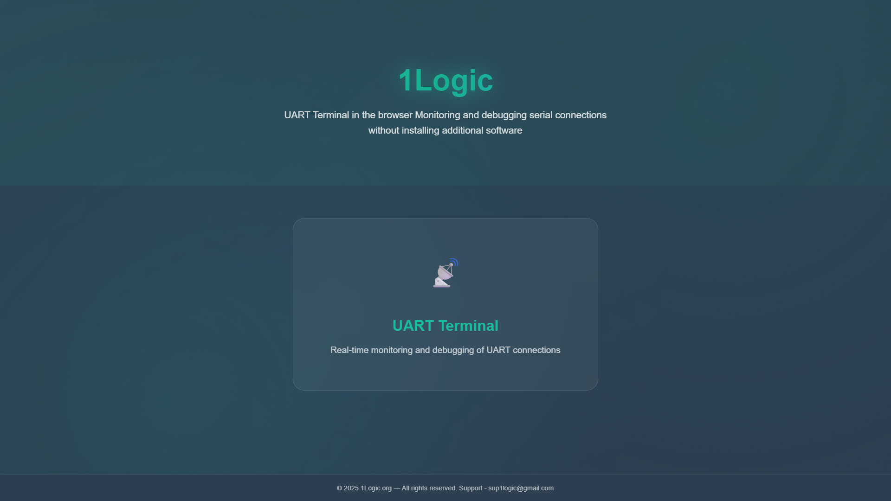
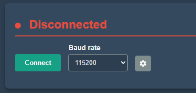
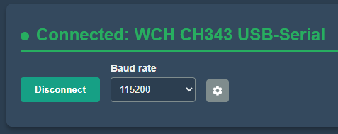
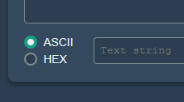
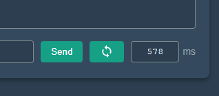
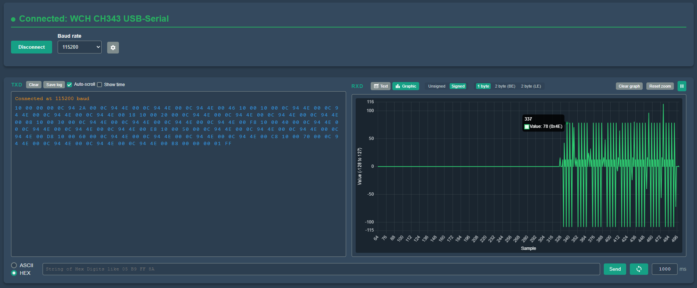

# Uartdebug — UART Terminal (Web)

A fast, modern UART terminal that runs **entirely in your browser** using the Web Serial API — no drivers or extra software to install.
It features text and hex transmission, auto‑scrolling logs, log export, **oscilloscope‑style live plotting** (1‑byte / 2‑byte BE/LE, signed/unsigned), and a clean dark UI.

> Works on Chromium‑based browsers (Chrome, Edge, Opera) over **HTTPS** or **localhost**.

---

## Table of Contents

- [Features](#features)
- [Screenshots](#screenshots)
- [Quick Start](#quick-start)
- [Usage](#usage)
  - [Connect](#connect)
  - [Transmit (TXD)](#transmit-txd)
  - [Receive (RXD)](#receive-rxd)
  - [Oscilloscope View](#oscilloscope-view)
  - [Keyboard Shortcuts](#keyboard-shortcuts)
- [Requirements & Browser Support](#requirements--browser-support)
- [Troubleshooting](#troubleshooting)
- [Project Structure](#project-structure)
- [Security & Privacy](#security--privacy)
- [Roadmap](#roadmap)
- [Contributing](#contributing)
- [License](#license)

---

## Features

- **One‑click connect** to any serial device supported by your OS.
- **Baud rates**: 9600, 19200, 38400, 57600, 115200, 230400, 460800, **921600**.
- **Friendly device names** for common USB‑to‑UART chips (CH340/341/343, CP210x, FT232, PL2303, Espressif, Arduino, etc.).
- **TXD/RXD terminals**:
  - ASCII and HEX input modes.
  - Optional timestamps; auto‑scroll.
  - **Save log** to a `.txt` file.
- **Looped sending** with adjustable interval (100–10000 ms).
- **Oscilloscope view**:
  - Signed/Unsigned.
  - **1 byte**, **2 byte (Big‑Endian / Little‑Endian)**.
  - Live pause/play, clear graph, **reset zoom/pan**.
- Fully client‑side. No server required.

---

## Quick Start

Just open **https://uartdebug.com** in a supported browser and launch **UART Terminal** from the home page.

> The app runs entirely in your browser via the Web Serial API. Uartdebug is served over **HTTPS**, so Web Serial permissions will work out of the box on Chromium‑based browsers (Chrome, Edge, Opera).

### Landing

## Usage

### Connect

1. Click **Connect**.
2. Choose your serial device from the browser’s port picker.
3. Select **Baud rate** (default: 115200). Optional parameters are in **Settings** (gear icon).
4. The status line turns **green** with the device name when connected.

#### Disconnected State

#### Connected State (friendly name shown)

### Transmit (TXD)

- Pick **ASCII** or **HEX** (left radio group under the TXD editor).
- **ASCII**: type text and click **Send** (CR/LF handling per settings).
- **HEX**: enter bytes like `05 B9 FF 8A` (two hex digits per byte, **space‑separated**).
- **Loop sending**: click the circular arrows; set the interval (ms).

#### Input Mode Switch (ASCII / HEX)

#### Loop Sending Control

### Receive (RXD)

- The right terminal shows incoming data.
- Use **Auto‑scroll** and **Show time** toggles.
- **Save log** exports TX and RX streams to a text file.

### Oscilloscope View

- Switch RXD from **Text** to **Graphic** to enable live plotting.
- Choose **Signed/Unsigned** and **1 byte / 2 byte (BE/LE)** to interpret the data.
- Controls: **Pause/Play**, **Clear graph**, **Reset zoom**.

> Tip: In 2‑byte modes, values are parsed from consecutive byte pairs using the selected endianness.

#### Oscilloscope View (live plot)

### Keyboard Shortcuts

- **Ctrl + Enter** — Send current input
- **Ctrl + L** — Clear terminals
- **Ctrl + S** — Save log
- **Space** — Pause/Play graph (when active)
- **R** — Reset graph zoom/pan

---

## Requirements & Browser Support

- **Chromium‑based browser** with Web Serial API (Chrome, Edge, Opera).
- **Secure context**: page must be served from **HTTPS** or **localhost**.
- OS‑level drivers for your adapter (CH34x, CP210x, FT232, etc.) as needed.

If **Connect** is disabled or the page cannot access serial ports, check that your browser supports Web Serial and that you’re on HTTPS/localhost.

---

## Troubleshooting

- **No ports listed / “Connect” does nothing** — Use Chrome/Edge on HTTPS or localhost. Ensure the OS has a driver for your adapter.
- **“Port already open” or “Permission denied”** — Close other apps using the same COM/tty port and reconnect.
- **Garbled characters** — Baud rate or framing mismatch. Match the device’s settings.
- **HEX input errors** — Use `AA 01 0F` style: two hex digits per byte, separated by spaces.
- **Flat or noisy plot** — Verify **byte size** and **signed/unsigned** interpretation.

---

## Security & Privacy

- Runs **entirely in your browser**; data never leaves your machine.
- Browser prompts you to **grant access** to a serial port; you can revoke permissions at any time.

---

## Contributing

Issues and PRs are welcome. Please keep the UI consistent with the existing style and update documentation for new features.
