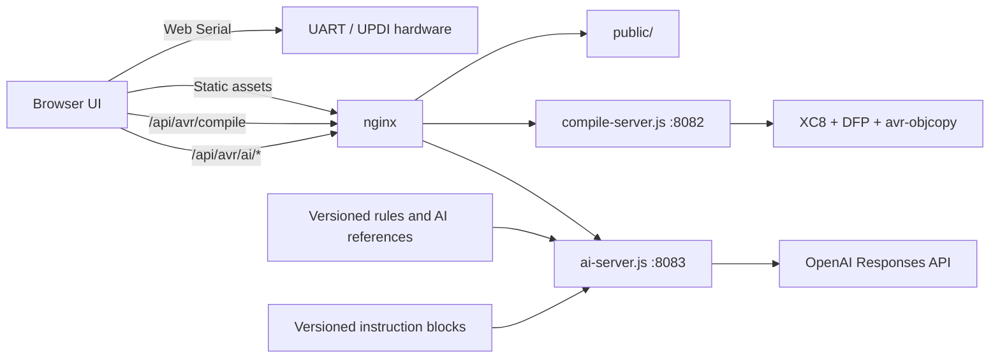

# Uart Debug

Browser-based tools for working with UART connections and tinyAVR microcontrollers.

[Open Uart Debug](https://uartdebug.com) · [UART Terminal](https://uartdebug.com/uart) · [AVR Programming](https://uartdebug.com/avr) · [Privacy](https://uartdebug.com/privacy) · [Terms](https://uartdebug.com/terms) · [Contributing](CONTRIBUTING.md) · [Security](SECURITY.md) · [License](LICENSE)

Uart Debug combines two related tools in one installable web app:

- **UART Terminal** communicates directly with a serial adapter through the Web Serial API.
- **AVR Programming** provides a browser editor, guided mini-projects, server-side XC8 compilation, and UPDI flashing. Its optional AI assistant can answer AVR questions and create or update mini-project drafts.

The repository is under active development. Hardware access requires a browser that implements Web Serial and a secure context (`https://` or `localhost`).

## Features

### UART Terminal

- Connect to USB-to-UART adapters without a desktop terminal application.
- Send and receive ASCII or hexadecimal data.
- Configure baud rate, data bits, stop bits, and parity.
- Repeat transmissions at a configurable interval.
- Generate sine, triangle, and square sample streams.
- View received 1-byte or 2-byte signed/unsigned values as a live plot.
- Export TX/RX logs and captured graphs.

### AVR Programming

- Edit C source and related project files in a CodeMirror workspace.
- Keep local working copies in the browser and organize files into groups.
- Import individual source, guide, firmware, or Uart Debug mini-project ZIP files.
- Browse localized, image-capable Markdown guides beside the editor.
- Follow `//# Heading` through `//###### Heading` comment links from C code to matching guide sections.
- Compile supported tinyAVR projects with Microchip XC8 on the compiler service.
- Detect a supported chip and flash Intel HEX over UPDI from the browser.
- Ask the AVR assistant ordinary questions, revise a reviewable Markdown project instruction, create a new mini-project, or update the currently open mini-project.
- Build that instruction manually or from versioned drag-and-drop blocks, with an immediate formatted preview.

## Browser and hardware requirements

- A browser with the Web Serial API. Chromium-based desktop browsers are the primary supported environment.
- HTTPS on a hosted installation, or `localhost` during development.
- An OS driver for the selected USB-to-UART adapter, when the operating system requires one.
- Suitable UART or UPDI wiring and target hardware for device operations.
- Microchip XC8, the matching ATtiny Device Family Pack, and `avr-objcopy` on the compiler host. These tools are not bundled with this repository.

Editing, guides, and imported files work without connected hardware. Compilation and AI features require their corresponding backend services.

## How data is handled

The old README described the entire project as client-only. That is true for serial communication, but not for every AVR feature:

- UART and UPDI bytes travel directly between the browser and the serial port selected in the browser permission prompt.
- AVR working copies and preferences are stored in browser `localStorage`.
- Compiling sends the selected source and linked project files to the Uart Debug compiler service. The service builds in a temporary directory and removes it after the request.
- Using the AI assistant sends the prompt, conversation, selected MCU, current mini-project context, reviewed Markdown instruction, referenced instruction-block identifiers, and a pseudonymous browser-installation safety identifier to the Uart Debug AI service and then to the configured OpenAI API. The API request uses `store: false`.
- When enabled, the Google access layer identifies a signed-in account by Google's verified `sub` claim and a “device” only as a best-effort browser installation. It does not collect or prove a hardware identifier.
- When the assistant creates or updates a project, the default server configuration makes the generated AI specification eligible for cleanup after 30 days and keeps at most 100 drafts. Cleanup runs during later draft activity. Source and human-guide copies are returned to the browser.
- The OpenAI API key is a server-side systemd credential and is never sent to browser code.

Do not put secrets in editor files, prompts, issues, pull requests, or repository configuration. See [SECURITY.md](SECURITY.md) for private vulnerability reporting.

The access/credit design, including Google setup, the provisional free grant,
integer provider-cost accounting, and the proposed 2:1:1 paid/free/project fund,
is documented in [`docs/AI_ACCESS_AND_CREDITS.md`](docs/AI_ACCESS_AND_CREDITS.md).
Guarantees the browser cannot provide and decisions that block paid access are
kept explicitly in [`docs/PRODUCT_LIMITATIONS.md`](docs/PRODUCT_LIMITATIONS.md).

## Architecture


```mermaid
flowchart LR
  Browser[Browser UI] -->|Web Serial| Hardware[UART / UPDI hardware]
  Browser -->|Static assets| Nginx[nginx]
  Browser -->|/api/avr/compile| Nginx
  Browser -->|/api/avr/ai/*| Nginx
  Nginx --> Static[public/]
  Nginx --> Compiler[compile-server.js :8082]
  Compiler --> Toolchain[XC8 + DFP + avr-objcopy]
  Nginx --> AI[ai-server.js :8083]
  Rules[Versioned rules and AI references] --> AI
  Skills[Versioned instruction blocks] --> AI
  AI --> OpenAI[OpenAI Responses API]
```

The compiler and AI services bind to loopback by default. nginx is the public same-origin boundary and routes only the required API paths to them.

## AVR mini-project format

A mini-project has three synchronized roles:

1. **Source** — a `.c` file with code and minimal inline commentary.
2. **Human guide** — one or more `_help...md` files, optionally differentiated by locale, plus optional raster images.
3. **AI specification** — an `_AI_<version>.md` file used by the server when the assistant reasons about or derives projects.

The public source and human guides live under [`public/avr-mini-projects`](public/avr-mini-projects). AI references live under [`backend/ai/mini-projects`](backend/ai/mini-projects) and are not served as static browser assets, although they remain visible in this public source repository.

The two catalogs keep the browser and server views synchronized:

- [`public/avr-mini-projects/catalog.json`](public/avr-mini-projects/catalog.json) lists source files, localized guides, and asset locations.
- [`backend/ai/mini-projects/catalog.json`](backend/ai/mini-projects/catalog.json) lists AI files and verifies them with SHA-256 hashes.

The first paragraph below the exact `## Short Project Description` heading in the default human guide becomes the Add file card description. New public mini-project assets must also be added to the service-worker app shell in [`public/sw.js`](public/sw.js).

Built-in projects are copied into the browser workspace before editing; repository originals are not modified by the page.

The separate AI workspace keeps a revisioned project instruction in browser
`localStorage`. Its allowlisted instruction-block catalog lives under
[`backend/ai/skills`](backend/ai/skills), may intentionally be empty, and can
later publish Markdown blocks verified by version and SHA-256 without changing
the browser/API contract. Private mini-project AI references are not returned by
that endpoint. An AI instruction edit must target the exact revision the user
submitted, so a delayed response cannot overwrite newer manual changes.

## Local development

Prerequisites: Git, Node.js 22.13 or newer, npm, Python 3, and a compatible browser.

```sh
git clone https://github.com/K1LLERV1PV2/uartdebug.git
cd uartdebug
npm ci --prefix backend
npm test --prefix backend
python -m http.server 8000 --directory public
```

Open `http://localhost:8000`. A static server is enough for the UART terminal and client-side AVR workspace. Compilation and AI calls also need a same-origin reverse proxy to their local services.

Start the compiler service after installing XC8 and `avr-objcopy`:

```sh
npm run start:compiler --prefix backend
```

It listens on `127.0.0.1:8082` by default. Tool paths can be overridden with `XC8_CC`, `XC8_DFP`, and `AVR_OBJCOPY`.

The AI service is optional:

```sh
npm run start:ai --prefix backend
```

The command starts the HTTP service, but generation remains disabled until `AI_ENABLED=1` and `OPENAI_API_KEY_FILE` points to a protected key file outside the repository. Configure `ALLOWED_ORIGINS` for the local frontend origin as well. Local variables, rule packs, systemd credentials, and production setup are documented in [`backend/AI-SETUP.md`](backend/AI-SETUP.md). Never commit an API key or place it in public browser code.

## Tests

The test suite uses Node's built-in test runner:

```sh
npm test --prefix backend
```

Tests cover the AI HTTP boundary, rule packs, project actions, mini-project normalization and ZIP validation, documentation markers, catalog rendering, and AVR page wiring. Pull requests and pushes to `main` are checked by [GitHub Actions](.github/workflows/ci.yml).

## Deployment

The production workflow in [`.github/workflows/deploy.yml`](.github/workflows/deploy.yml) deploys pushes to `main` into versioned server releases, validates health endpoints, and supports rollback. Deployment credentials stay in GitHub Actions secrets; the OpenAI key stays in a restricted systemd credential file on the host.

Production setup is intentionally not a copy-and-paste local quick start: it also requires nginx, systemd services, XC8/DFP installation, filesystem permissions, DNS, and TLS configuration.

## Repository structure

| Path | Purpose |
| --- | --- |
| `public/` | Static PWA, UART terminal, AVR editor/programmer, mini-project source and guides, vendored browser libraries |
| `backend/` | Compiler service, AI service, versioned rules, AI references, instruction blocks, and deployment files |
| `docs/` | Product architecture decisions, access/credit design, and explicit limitations |
| `tests/` | Node test suite |
| `.github/workflows/` | CI and production deployment workflows |
| `.github/scripts/` | Build metadata tooling used by deployment |

## Contributing and support

Bug reports and focused pull requests are welcome. Read [CONTRIBUTING.md](CONTRIBUTING.md) and the [Code of Conduct](CODE_OF_CONDUCT.md) before participating. Use GitHub Issues for reproducible bugs and feature proposals, and email [uartdebug@gmail.com](mailto:uartdebug@gmail.com) for support that should not be public.

Security vulnerabilities must not be posted in a public issue; follow [SECURITY.md](SECURITY.md).

## Third-party software

The browser bundle includes vendored Chart.js and CodeMirror files. Their versions, upstream links, and license copies are recorded in [THIRD_PARTY_NOTICES.md](THIRD_PARTY_NOTICES.md). Those licenses apply only to the named third-party components.

## Project license

Except for the third-party components identified in [THIRD_PARTY_NOTICES.md](THIRD_PARTY_NOTICES.md), Uart Debug's original source code, documentation, and mini-projects are licensed under the [GNU Affero General Public License v3.0 only](LICENSE) (`AGPL-3.0-only`).

The license permits use, modification, and redistribution, including commercial use. Operators of modified network-accessible versions must offer their users the corresponding source code under the same license. The license does not grant rights to Uart Debug names, logos, or other trademarks.
